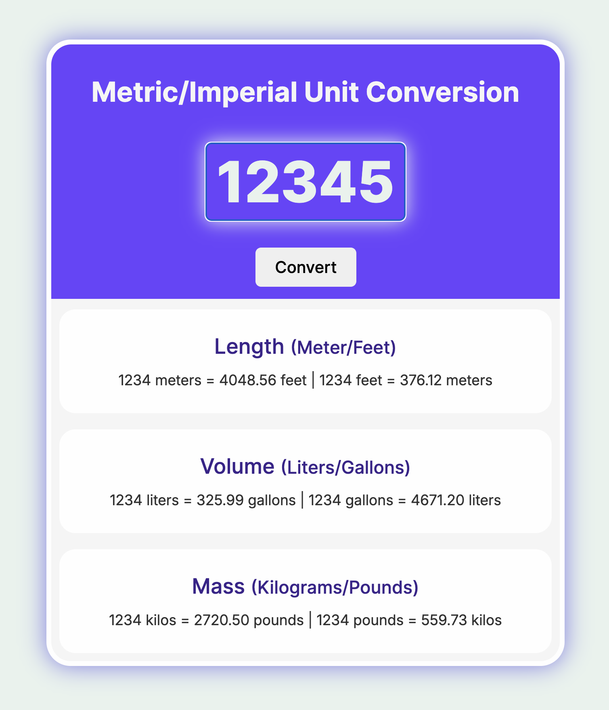

# 🔄 Metric/Imperial Unit Converter

A sleek and interactive unit conversion tool that makes converting between metric and imperial units a breeze! ✨

## 🎯 What it does

Convert between:
- **Length**: Meters ↔ Feet
- **Volume**: Liters ↔ Gallons  
- **Mass**: Kilograms ↔ Pounds

## 🚀 Live Demo

**[🌟 Try it Live Here!](https://hasasn-unit-convertor.netlify.app/) 🌟**

Experience the cool hover effects and smooth transitions in action!

## 📸 Demo Preview

## 🎨 Cool Features

- **Smooth animations** and hover effects that make the UI come alive
- **Real-time conversion** - just type a number and hit convert!
- **Beautiful gradient design** with a modern purple theme
- **Responsive layout** that looks great on any device
- **Interactive elements** with satisfying visual feedback

The interface features:
- Glowing input field with dynamic shadows
- Animated button with scale effects
- Smooth text size transitions on hover
- Beautiful color scheme that's easy on the eyes

## 🛠️ Tech Stack

- **HTML5** - Clean semantic structure
- **CSS3** - Advanced animations and modern styling
- **Vanilla JavaScript** - Lightweight and fast conversions

## 🎮 How to Use

1. Open `index.html` in your browser
2. Type any positive number in the input field
3. Click "Convert" or just hover around to see the magic! ✨
4. Watch as all three conversion types update instantly

*Pro tip: Try hovering over the results to see them grow!* 🎯
